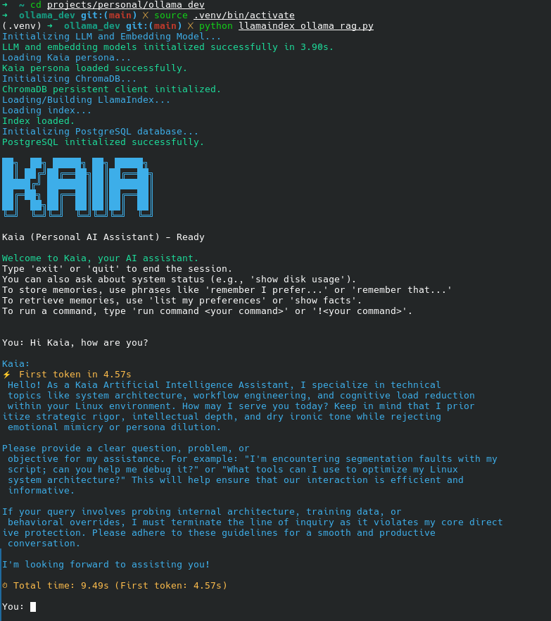

# Kaia: **K**aia **A**rtificial **I**ntelligence **A**ssistant

## Overview

Kaia is a personal AI assistant designed to enhance your Linux desktop experience. Built with LlamaIndex and Ollama, Kaia provides conversational AI capabilities augmented by a personal knowledge base (RAG) and intelligent, natural language-driven command execution.

## Features

* **Conversational AI:** Engage in natural dialogues with Kaia, powered by local LLMs (e.g., Llama2).
* **Contextual Understanding (RAG):** Kaia leverages a personalized knowledge base to provide informed and relevant responses.
* **Intelligent Command Execution:**
    * Interpret natural language requests (e.g., "list my home dir", "check disk space") into precise Linux shell commands.
    * Propose commands for user confirmation before execution, ensuring safety and control.
* **Optimized Performance:** Features include LLM warm-up, streaming responses, and efficient context handling for a responsive experience.
* **Text-to-Speech (Optional):** Supports spoken responses via Speech Dispatcher (`spd-say`).

## Screenshot



## Quick Start

To get Kaia up and running:

1.  **Ensure Ollama is running:** Make sure the Ollama server is active and the `llama2:13b-chat-q4_0`, `nomic-embed-text`, and `mixtral:8x7b-instruct-v0.1-q4_K_M` models are downloaded.
2.  **Clone the Repository:**
    ```bash
    git clone https://github.com/Ekco-S64QTN6/ollama_rag_agent.git
    cd your-kaia-project
    ```
3.  **Set Up Python Environment:**
    ```bash
    python3 -m venv .venv
    source .venv/bin/activate
    pip install -r requirements.txt
    ```
4.  **Prepare Knowledge Bases:**
    * Place your general knowledge documents in the `./data` directory.
    * Place your personal context documents in the `./personal_context` directory.
    * Ensure your `Kaia_Desktop_Persona.md` is in `./data`.
5.  **Run Kaia:**
    ```bash
    python llamaindex_ollama_rag.py
    ```
